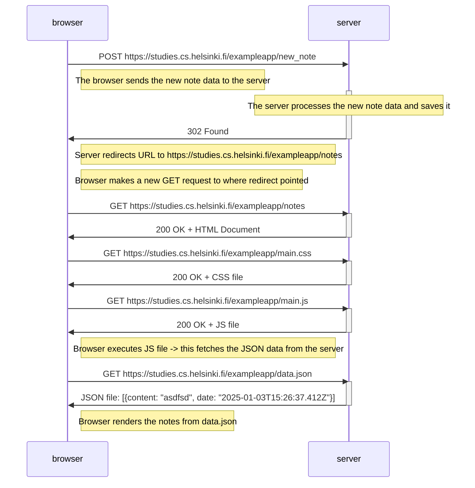

```mermaid

sequenceDiagram
    participant browser
    participant server

    browser->>server: POST https://studies.cs.helsinki.fi/exampleapp/new_note
    Note right of browser: The browser sends the new note data to the server
    activate server
    Note over server: The server processes the new note data and saves it
    server->>browser: 302 Found
    deactivate server

    Note left of server: Server redirects URL to https://studies.cs.helsinki.fi/exampleapp/notes

    Note right of browser: Browser makes a new GET request to where redirect pointed

    browser->>server: GET https://studies.cs.helsinki.fi/exampleapp/notes
    activate server
    server->>browser: 200 OK + HTML Document
    deactivate server

    browser->>server: GET https://studies.cs.helsinki.fi/exampleapp/main.css
    activate server
    server->>browser: 200 OK + CSS file
    deactivate server

    browser->>server: GET https://studies.cs.helsinki.fi/exampleapp/main.js
    activate server
    server->>browser: 200 OK + JS file
    deactivate server

    Note right of browser: Browser executes JS file -> this fetches the JSON data from the server

    browser->>server: GET https://studies.cs.helsinki.fi/exampleapp/data.json
    activate server
    server->>browser: JSON file: [{content: "asdfsd", date: "2025-01-03T15:26:37.412Z"}]
    deactivate server

    Note right of browser: Browser renders the notes from data.json

```
