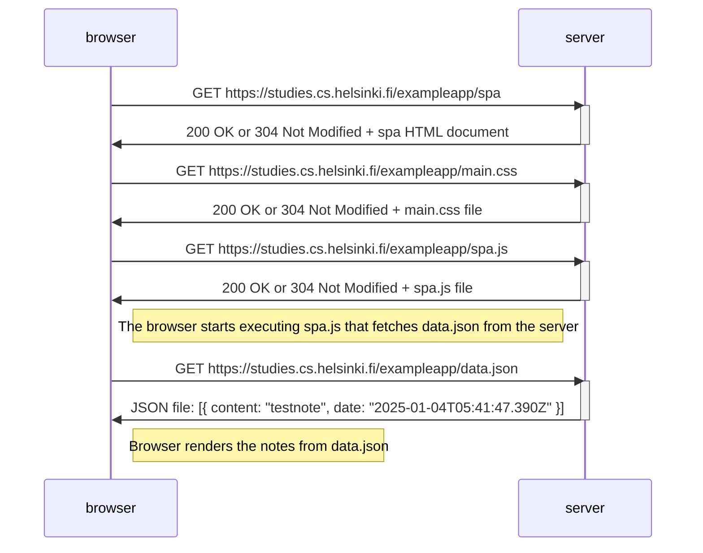

```mermaid

sequenceDiagram
    participant browser
    participant server

    browser->>server: GET https://studies.cs.helsinki.fi/exampleapp/spa
    activate server
    server->>browser: 200 OK or 304 Not Modified + spa HTML document
    deactivate server

    browser->>server: GET https://studies.cs.helsinki.fi/exampleapp/main.css
    activate server
    server->>browser: 200 OK or 304 Not Modified + main.css file
    deactivate server

    browser->>server: GET https://studies.cs.helsinki.fi/exampleapp/spa.js
    activate server
    server->>browser: 200 OK or 304 Not Modified + spa.js file
    deactivate server

    Note right of browser: The browser starts executing spa.js that fetches data.json from the server

    browser->>server: GET https://studies.cs.helsinki.fi/exampleapp/data.json
    activate server
    server->>browser: JSON file: [{ content: "testnote", date: "2025-01-04T05:41:47.390Z" }]
    deactivate server

    Note right of browser: Browser renders the notes from data.json
```
