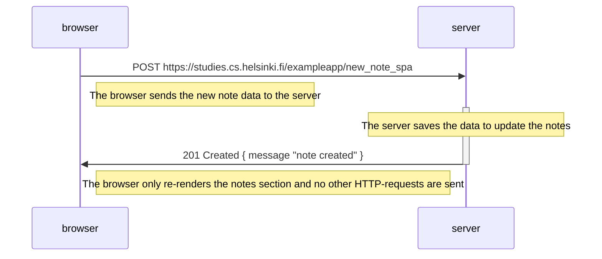

```mermaid

sequenceDiagram
    participant browser
    participant server

    browser->>server: POST https://studies.cs.helsinki.fi/exampleapp/new_note_spa
    Note right of browser: The browser sends the new note data to the server
    activate server
    Note over server: The server saves the data to update the notes
    server->>browser: 201 Created { message	"note created" }
    deactivate server

    Note right of browser: The browser only re-renders the notes section and no other HTTP-requests are sent

```
